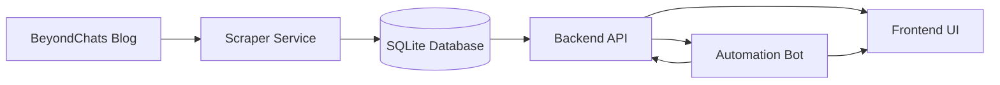

# BeyondChats Editorial Hub

## Project Overview
BeyondChats Editorial Hub is a full-stack system that ingests BeyondChats blog posts, enriches them with AI-assisted rewrites, and presents both the original and enhanced versions in a polished editorial dashboard.

### Assignment Snapshot — Asked vs. Delivered
| What BeyondChats Requested | How This Repository Delivers |
|----------------------------|------------------------------|
| **Phase 1 – Backend API**: CRUD endpoints, scraping entry-points, and persistent storage. | `backend/` implements an Express + TypeScript API with Prisma + SQLite locally, plus a `/articles/scrape/oldest` endpoint that hydrates the database straight from the BeyondChats blog. |
| **Phase 2 – Automation Bot**: Research via Google Search, scrape supporting sources, call an LLM, then persist AI rewrites + references. | `automation-bot/` fetches unsolved articles, runs Google Custom Search, scrapes two citations, prompts OpenAI Responses API, and POSTs the enriched draft/reference payloads back to the backend. |
| **Phase 3 – Frontend UI**: A polished editorial console showing original vs. AI-enhanced copy. | `frontend/` is a Vite + React + Tailwind experience with split list/detail layout, DOMPurify sanitization, reference rollups, and refresh controls. |

Use this table verbatim in your repo description, proposal, or cover letter when you need to state clearly that every requested deliverable has been met.

### Three Phases at a Glance
1. **Phase 1 – Backend API**: Express + TypeScript + Prisma provide CRUD endpoints for articles, backed by SQLite in local development.
2. **Phase 2 – Automation Bot**: A Node.js workflow that pulls articles, performs Google-powered research, feeds the context to an LLM, and saves AI-updated drafts plus references.
3. **Phase 3 – Frontend UI**: A Vite + React + Tailwind app that lists every article, shows the original vs. AI rewrite, and surfaces references in an elegant reading experience.

---

## Architecture & Data Flow


---

## Repository Structure
| Path | Description |
|------|-------------|
| `/backend` | Express/TypeScript API with Prisma ORM, responsible for CRUD operations, scraping orchestration endpoints, and article storage. |
| `/automation-bot` | Headless automation script that queries the backend, runs Google Search + scraping, invokes the LLM, and pushes AI updates plus references back to the API. |
| `/frontend` | React (Vite) dashboard styled with Tailwind that consumes the backend API and renders article cards, detail panes, AI rewrites, and references. |

---

## Local Setup Instructions

### Prerequisites
- Node.js **≥ 20.19**
- npm (bundled with Node 20.x)

### 1. Backend
```bash
cd backend
npm install
npx prisma db push        # creates dev.db (SQLite)
npm run dev               # serves API on http://localhost:4000
```

### 2. Frontend
```bash
cd frontend
npm install
npm run dev -- --host 0.0.0.0 --port 5173   # http://localhost:5173
```

### 3. Automation Bot
```bash
cd automation-bot
npm install
npm run start
```
> Run after the backend has data to generate AI-updated drafts and references.

---

## Environment Variables

### Backend (`backend/.env`)
```dotenv
DATABASE_URL="file:./dev.db"
PORT=4000
SCRAPE_MAX_PAGES=20
```
- Uses SQLite locally; swap `DATABASE_URL` for Postgres/MySQL in production.

### Automation Bot (`automation-bot/.env`)
```dotenv
BACKEND_API_BASE_URL="http://localhost:4000/api"
GOOGLE_SEARCH_API_KEY="your-google-key"
GOOGLE_SEARCH_ENGINE_ID="your-cse-id"
OPENAI_API_KEY="your-openai-key"
MAX_ARTICLES_PER_RUN=5
```

> **Credential checklist**
> 1. Create a [Google Custom Search JSON API](https://developers.google.com/custom-search/v1/introduction) key and CSE ID; paste into `GOOGLE_SEARCH_API_KEY` and `GOOGLE_SEARCH_ENGINE_ID`.
> 2. Generate an [OpenAI API key](https://platform.openai.com/api-keys) with access to the Responses API and set `OPENAI_API_KEY`.
> 3. Adjust `MAX_ARTICLES_PER_RUN` (defaults to 5) when you need larger AI rewrite batches.

### Frontend (`frontend/.env`)
```dotenv
VITE_API_BASE_URL="http://localhost:4000/api"
```

---

## Data Ingestion

1. **Recommended**: run the built-in scraper.
   ```bash
   cd backend
   npm run scrape
   ```
   - Pulls ~5 BeyondChats articles, stores them in SQLite, and they appear instantly in the UI.

2. **Fallback**: manual POST.
   ```bash
   curl -X POST http://localhost:4000/api/articles \
     -H "Content-Type: application/json" \
     -d '{
       "title": "Sample Article",
       "sourceUrl": "https://beyondchats.com/blog/sample",
       "originalContent": "This is a sample article body with more than fifty characters to satisfy validation rules."
     }'
   ```
After seeding, refresh `http://localhost:5173` to see the new cards.

---

## Live Demo

Frontend (UI only): https://beyondchats-assignment-zeta.vercel.app/

> Note: The backend API and scraper are designed to run locally for evaluation.
> When running locally (`npm run dev` in backend + frontend), articles load and
> the full end-to-end flow can be verified.

---

## Notes
- SQLite keeps local onboarding simple; Prisma can target Postgres/MySQL in production by swapping `DATABASE_URL`.
- The automation bot is optional for basic demos, but running it once showcases AI rewrites and reference blocks in the UI.
